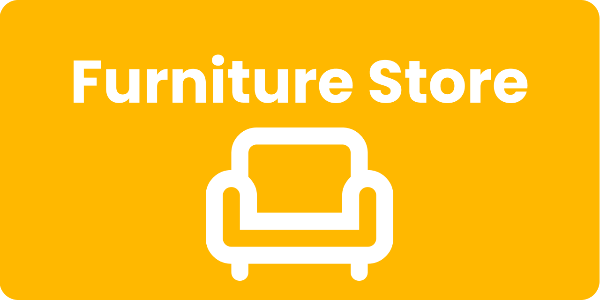
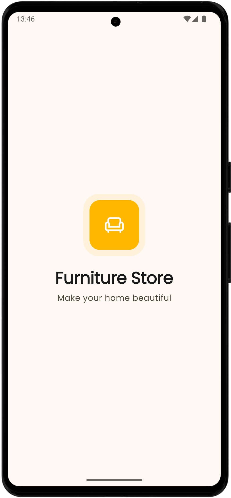
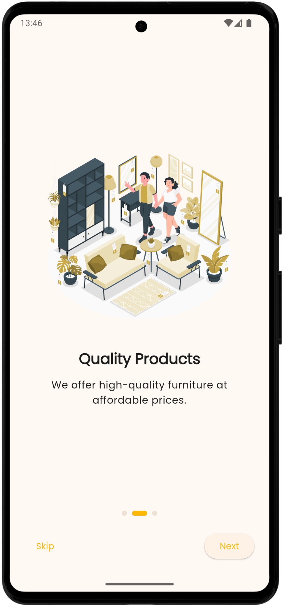

<div align="center">
  

  <h1>Furniture Store — Flutter App</h1>
  <p>A modern, animated shopping experience demonstrating clean Flutter architecture and UX best practices.</p>
</div>


## Table of contents
- Overview
- Features and how they work together
- Architecture and project structure
- App flow and navigation
- State management and persistence
- Animations and transitions
- Theming and extensions
- Assets
- Getting started (run and build)
- Extending the app
- License


## Overview
This app showcases a complete mobile shopping flow: splash → onboarding → home with tabs (Discover, Categories, Cart, Profile). It uses a simple domain entity (`Product`), in‑memory state with persistence (favorites and cart), animated navigation, and Material 3 components.


## Features and how they work together
- Modern UI with smooth animations
  - Animated tab switches and push transitions make navigation feel fluid.
  - Rounded bottom navigation with badge for the cart improves visual clarity.
- Onboarding → Home
  - The onboarding "Get Started" button navigates to the main home screen.
- Discover catalog grid
  - Displays a curated list of `Product`s (local assets). Tap a card to open the product detail screen.
  - Product images use Hero animations for continuity between list and detail.
  - Each grid tile includes:
    - Favorite toggle (heart) — persisted across sessions
    - "Add" button — adds to cart and shows a brief snackbar confirmation
- Search
  - AppBar search opens a search delegate with suggestions and results. Selecting a result navigates to its detail page.
- Cart
  - Items added from Discover or from Product Detail appear in Cart.
  - Swipe to remove; count is shown as a live badge on the bottom nav.
- Categories
  - Simple, animated list with thumbnails (maps logical categories to demo assets).
- Profile (placeholder)
  - A stub to demonstrate multi‑tab layout ready for user account features.

How they connect:
- All product displays (Discover grid, search results, details) reference the same domain entity `Product` (id, name, price, imagePath, rating).
- Favorites and cart use a shared `AppState` singleton for consistent updates. When you favorite or add from Discover or Details, the cart/favorites update everywhere and persist across app restarts.


## Architecture and project structure
Layered, feature‑first organization with a small `core` module:

```text
lib/
  application.dart            # Root MaterialApp
  bootstrap.dart              # Bootstrapping, logs, error handling
  core/
    extensions/               # BuildContext helpers (theme, mediaQuery)
    screens/                  # Splash, Onboarding
    themes/                   # ApplicationTheme (light/dark)
    app_state.dart            # AppState singleton (favorites, cart, persistence)
  features/home/
    domain/
      entities/               # Product entity
    presentation/
      screens/                # Home, Discover, Product Detail, Categories, Cart, Profile
      widgets/                # ProductCard, animated route
```

- `core` is reusable foundation (themes, extensions, bootstrapping, shared app state).
- `features/home` contains app‑specific UI and domain modeling for the shopping flow.


## App flow and navigation
1) Splash → Onboarding → Home (via `Navigator.pushReplacement`)

2) Home tabs (Discover, Categories, Cart, Profile)
   - Animated tab body (AnimatedSwitcher + slide+fade)

3) Discover → Product Detail (via custom fade+slide route)
   - Hero animation ties the product image between list/detail

4) Search (from Discover app bar)
   - Opens a SearchDelegate
   - Selecting a product navigates to its detail page


## State management and persistence
- `AppState` (in `lib/core/app_state.dart`)
  - `favoriteIds: ValueNotifier<Set<String>>`
  - `cartProductIds: ValueNotifier<List<String>>`
  - Persists to `SharedPreferences` (keys: `favorites_ids_v1`, `cart_ids_v1`)
- Why ValueNotifier
  - Simple, lightweight, and perfect for localized reactive updates (badges, icons, lists)
- Where it’s used
  - Discover: toggling favorites, adding to cart
  - Product Detail: adding to cart
  - Cart: rendering list and count badge


## Animations and transitions
- Page push: custom fade+slide route (see `features/home/presentation/widgets/animated_route.dart`)
- Tab content: AnimatedSwitcher with slide+fade
- Hero: product image transitions between Discover and Detail
- List item appearances: TweenAnimationBuilder used in Categories


## Theming and extensions
- `ApplicationTheme` (light/dark) configured via Material 3 color scheme
- `BuildContext` extensions (in `core/extensions`) expose:
  - `theme`, `colorScheme`, text styles, screen size, brightness, etc.


## Assets
Declared in `pubspec.yaml`:
- `assets/images/` (product imagery and icons)
- `assets/icons/`
- `documentation/images/` (banner)

Example preview:

<p align="center">
   
  
  <br/>
  
</p>


## Getting started
Prerequisites
- Flutter (stable) installed — see the official
  <a href="https://docs.flutter.dev/get-started/install" target="_blank">installation guide</a>

Install & run
```bash
flutter pub get
flutter run
```

Build release APK
```bash
# Standard APK
flutter build apk --release

# Split per ABI (smaller artifacts)
flutter build apk --release --split-per-abi
```
Output will be in `build/app/outputs/flutter-apk/`.

ADB install on a connected device
```bash
adb install -r build/app/outputs/flutter-apk/app-release.apk
```


## Extending the app
- Add a new product
  - Update the list in `DiscoverScreen.products` with `Product(id, name, price, imagePath)`
- Add a new tab (e.g., Orders)
  - Create screen in `features/home/presentation/screens/`
  - Append to `_pages` and `NavigationBar.destinations` in `HomeScreen`
- Use a server/back end
  - Replace the local product list with repository/data source calls
  - Persist favorites/cart to the network or a database instead of (or alongside) SharedPreferences


## License
This project is licensed under the MIT License — see [LICENSE](LICENSE).


